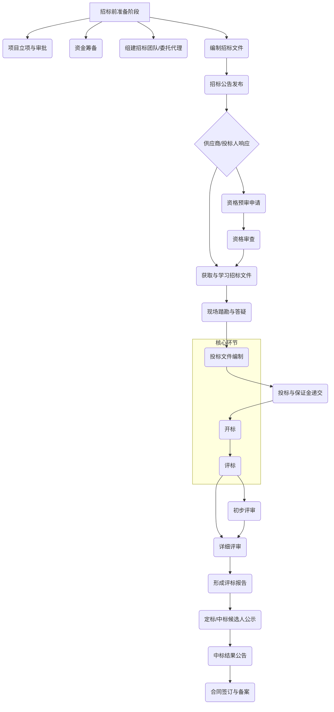

# 中国电力行业招投标全流程AI提效工具产品需求文档 (PRD)

## 1.0 执行摘要
本产品需求文档（PRD）旨在详细阐述“中国电力行业招投标全流程AI提效工具”的产品愿景、功能需求、用户画像和技术实现路径。该工具定位为一款SaaS（软件即服务）解决方案，利用人工智能（AI）技术，特别是自然语言处理（NLP）、机器学习（ML）和知识图谱（KG），为中国境内参与电力行业（涵盖配电、供电、输变电、光伏、充电桩等领域）招投标活动的企业提供从商机发现、标书编制、风险预警到投标决策的全流程智能化支持。

**核心问题：** 中国电力行业的招投标流程高度规范但极其复杂，参与者普遍面临信息过载、标书制作耗时耗力、合规风险高、决策主观性强等痛点。传统的“人海战术”不仅效率低下，且在激烈竞争中难以保证中标率。

**解决方案：** 本AI提效工具通过以下核心功能模块解决上述痛点：
*   **智能信息聚合与分析模块：** 自动化聚合全网招标信息，并根据企业能力画像进行智能推荐与可行性分析。
*   **智能标书一体化工作台：** 提供从招标文件智能解析、内容智能生成、多维度（合规、商务、技术）风险预警到智能排版校对的一站式服务。
*   **智能决策辅助模块：** 基于历史数据和市场行情，提供中标概率预测、报价策略建议和竞争对手分析。

**目标用户：** 工具主要服务于电力行业设备供应商、工程承包商、服务提供商等投标方企业内部的多个角色，包括市场/销售人员、标书制作员/经理、以及法务/合规人员。

**市场机遇与价值：** 随着国家大力推进“人工智能+”行动[[4]](https://www.guizhou.gov.cn/ztzl/2025zggjdsjcyblh/fhlt/202508/t20250828_88530180.html)，并鼓励AI在公共资源交易领域的应用，本工具的推出正逢其时。它将显著提升投标方的核心竞争力，通过技术手段实现降本增效，提高中标成功率，并推动整个行业的数字化与智能化转型。

## 2.0 绪论

### 2.1 项目背景与市场机遇
中国电力行业作为国家能源战略和“新基建”的核心组成部分，其市场规模庞大，招投标活动频繁且金额巨大。整个招投标流程遵循《中华人民共和国招标投标法》等严格的法律法规，并通过国家电网的ECP2.0平台[[2]](https://baijiahao.baidu.com/s?id=1827561639448931965&wfr=spider&for=pc)和南方电网的电子采购交易平台[[3]](https://baijiahao.baidu.com/s?id=1832064302090553090&wfr=spider&for=pc)等官方渠道进行，呈现出高度的程序化和电子化特征[[1]](https://www.huoban.com/yx-jiaocheng/zV2M4BBXExy8ojgq.html)。然而，在规范的背后，是极其繁琐、耗时的人工操作流程。

**当前行业核心痛点包括：**
*   **信息获取效率低下：** 招标信息分散在各大平台，企业需要投入大量人力进行筛选和初步评估，时常错失良机。
*   **标书制作成本高昂：** 一份高质量的标书制作周期长，涉及跨部门协作复杂，且重复性劳动占据大量时间。
*   **合规与废标风险高：** 招标文件条款复杂，资质、技术参数要求严苛，任何细微的疏漏都可能直接导致废标。
*   **决策主观性强：** 对于是否投标、如何报价等关键决策，很大程度上依赖个人经验，缺乏数据驱动的科学决策支持。
*   **竞争环境激烈：** 市场竞争日益激烈，低价中标现象普遍，企业利润空间被压缩，对精细化运营和成本控制提出更高要求。

在此背景下，国务院办公厅明确提出要“加快人工智能在各类公共资源招标投标活动中的应用，提升智能交易服务和监管水平”[[4]](https://www.guizhou.gov.cn/ztzl/2025zggjdsjcyblh/fhlt/202508/t20250828_88530180.html)，这为AI技术赋能招投标行业提供了强有力的政策支持。同时，以AI技术深度赋能招投标的智能评审、风险预警等应用已在南通市等地的公共资源交易中取得显著成效[[5]](https://baijiahao.baidu.com/s?id=1841119087048133923&wfr=spider&for=pc)，验证了其可行性和巨大价值。因此，开发一款专为中国电力行业设计的全流程AI提效工具，不仅能够直击行业痛点，更顺应了国家战略和技术发展的浪潮，市场前景广阔。

### 2.2 产品愿景与目标
**产品愿景：** 成为中国电力行业投标方首选的智能化战略合作伙伴，通过AI技术将企业从繁琐、低效的招投标事务中解放出来，聚焦于核心业务与战略决策，最终实现“让每一次投标都更具智慧”。

**产品目标：**
*   **近期目标 (1年内)：**
    *   **效率提升：** 将电力行业标书的平均制作周期缩短50%以上。
    *   **风险降低：** 将因格式、资质、条款响应疏漏等原因导致的废标率降低80%。
    *   **市场渗透：** 获取首批100家电力行业种子用户，并实现至少80%的活跃度。
*   **中期目标 (1-3年)：**
    *   **决策优化：** 通过智能决策辅助功能，帮助用户平均中标率提升10-15%。
    *   **生态构建：** 建立电力行业招投标知识图谱和数据库，提供更深度的行业洞察和市场趋势分析。
    *   **平台拓展：** 实现与国家电网ECP、南方电网等主流招投标平台的深度数据对接，提供更流畅的一体化体验。
*   **长期目标 (3年以上)：**
    *   将AI能力从投标方延伸至招标方，提供智能评标、供应商画像等服务，打造完整的电力招投标AI生态系统。
    *   拓展至其他大型基建领域（如交通、水利），成为中国招投标AI解决方案的领导者。

## 3.0 目标用户画像
为了确保产品设计紧密围绕真实用户需求，我们构建了以下三类核心用户画像：

| 画像模块 | 市场/销售人员 (The Business Hunter) | 标书制作员/经理 (The Bid Master) | 法务/合规人员 (The Guardian of Rules) |
| --- | --- | --- | --- |
| **角色简介** | 王经理，35岁，一家中型电力设备供应商的市场部负责人。他精力充沛，每日奔波于寻找商机和客户关系维护之间，是公司业务增长的“前锋”。 | 李工，28岁，某电力工程公司的标书制作专员。他做事严谨细致，是典型的“细节控”，每天与海量的招标文件和技术参数打交道，是决定投标成败的“操盘手”。 | 刘法务，40岁，大型输变电集成商的法务总监。她逻辑严密，经验丰富，时刻保持高度警惕，是公司业务安全运行的“守护神”。 |
| **工作目标 (Goals)** | - 尽快发现并锁定与公司业务高度匹配的招标项目。\n- 科学评估每个商机的利润空间和中标可能性，避免无效投入。\n- 提升市场信息获取和初步分析的效率，抢占先机。 | - 100%响应招标文件要求，确保标书在技术和商务上完全合规，避免废标。\n- 在紧迫的时间内，高效、准确地完成高质量标书的编制与提交。\n- 突出公司优势，在众多竞争者中脱颖而出。 | - 确保公司所有招投标活动完全符合国家及地方性法律法规，实现“零违规”。\n- 识别并规避招标文件及后续合同中的所有潜在法律和商业风险。\n- 在出现争议时，为公司提供坚实的法律依据和保护。 |
| **核心痛点 (Pain Points)** | - **信息过载，筛选困难：** 每天面对数百条招标公告，人工筛选犹如大海捞针，不仅效率低下，还容易遗漏重要项目[[1]](https://www.huoban.com/yx-jiaocheng/zV2M4BBXExy8ojgq.html)。\n- **评估主观，决策凭经验：** 对一个项目是否值得投标，往往依赖个人经验和直觉判断，缺乏客观数据支持，导致资源浪费。\n- **信息壁垒，内外部协同难：** 获取竞争对手信息渠道有限；内部协调技术和商务部门评估项目时，沟通成本高，信息传递易失真。 | - **文档研读耗时且易出错：** 上百页的招标文件，包含复杂的技术参数和晦涩的商务条款，人工逐条研读极易出错或遗漏关键点[[1]](https://www.huoban.com/yx-jiaocheng/zV2M4BBXExy8ojgq.html)。\n- **重复性工作量巨大：** 填写公司资质、整理历史业绩、调整格式等重复性工作占据了大量时间，挤压了用于提升标书质量的核心思考时间。\n- **版本管理混乱：** 在多人协作编制标书时，技术、商务、报价等各部分文件版本混乱，最终整合时容易出错。 | - **合规审查压力大：** 招投标领域的法律法规更新快，覆盖面广，人工审查难以确保100%覆盖最新要求，责任重大。\n- **风险识别难度高：** 招标文件中的某些条款可能隐藏着不平等的“陷阱”，需要花费大量时间进行深度法律分析。\n- **隐性风险难发现：** 对于围标串标等违法行为，传统审查手段难以发现，一旦卷入将对公司声誉造成巨大损害[[5]](https://baijiahao.baidu.com/s?id=1841119087048133923&wfr=spider&for=pc)。 |
| **AI工具的期望** | - **智能商机推送：** AI能像私人助理一样，根据公司预设的资质、业务范围、区域偏好，自动推送精准匹配的招标信息，并附上项目摘要和关键指标。\n- **项目价值智能评估：** AI能快速分析项目要求和历史数据，初步评估项目的中标概率、潜在利润率和主要竞争对手，提供决策参考。\n- **招标文件自动摘要：** 无需下载全文，AI直接生成一份包含项目预算、核心资质要求、关键截止日期等信息的核心摘要报告。 | - **招标文件一键解析：** AI能将非结构化的招标文件自动解析为结构化的任务清单（To-do List），清晰列出所有必须响应的条款和需要准备的材料。\n- **内容智能生成与填充：** 基于企业知识库，AI自动填充公司资质、历史业绩等标准化内容，并能根据项目要求，智能生成技术方案、服务承诺等内容的初稿。\n- **全自动排版与校对：** 一键完成全文格式统一、目录生成、页码页眉设置，并对错别字、标点符号、数据一致性等进行智能校对。 | - **智能合规审查引擎：** AI实时对接最新的法律法规库，自动审查标书内容，对可能存在的违规点进行高亮预警并提供修改建议。\n- **风险条款智能识别：** AI能自动识别并标记出招标文件和合同草案中的不合理、有风险的条款（如无限责任、支付条件苛刻等）。\n- **围串标行为智能预警：** AI通过分析投标文件的文本相似度、报价规律等特征，智能预警潜在的围标串标风险，保护公司远离合规雷区。 |

*图1：中国电力行业招投标通用流程图*

## 4.0 功能需求 (Functional Requirements)

### 4.1 功能总览
“中国电力行业招投标全流程AI提效工具”将围绕投标方的核心工作流，构建三大核心功能模块，分别是：**A. 智能信息聚合与分析**、**B. 智能标书一体化工作台**、**C. 智能决策辅助**。这三大模块环环相扣，旨在为用户提供从机会到合同的全流程闭环式智能支持。

| 模块 | 功能点 | 需求描述 | 优先级 |
| --- | --- | --- | --- |
| **A. 智能信息聚合与分析** | A1. 全网商机自动搜集与订阅 | 系统7x24小时自动搜集并更新来自全国公共资源交易平台、各大电网公司（如国家电网ECP[[2]](https://baijiahao.baidu.com/s?id=1827561639448931965&wfr=spider&for=pc)、南方电网[[3]](https://baijiahao.baidu.com/s?id=1832064302090553090&wfr=spider&for=pc)）电子采购平台、及各省市交易中心的电力行业（配电、输变电、光伏、充电桩等）招标公告。用户可根据关键词、地域、项目金额、业务类型等维度设置个性化订阅规则。 | **Must-have** |
| A. 智能信息聚合与分析 | A2. 智能项目推荐与匹配 | 基于用户预先录入的企业资质、历史业绩、技术能力、目标市场等信息，构建企业能力画像。利用AI算法对新搜集的招标项目进行智能分析，计算与企业画像的匹配度，并将高匹配度的项目优先推送给用户，并附上匹配原因说明。 | **Must-have** |
| A. 智能信息聚合与分析 | A3. 项目快速评估报告 | 针对用户感兴趣的项目，AI能在一分钟内自动生成一份快速评估报告。报告内容包括：项目概况摘要、核心资质与业绩要求（自动与企业资质进行比对）、关键时间节点（报名、投标截止、开标等）、历史类似项目中标情况分析、以及潜在的风险点提示（如排他性条款）。 | **Should-have** |
| **B. 智能标书一体化工作台** | B1. 招标文件智能深度解析 | 用户上传招标文件后，AI引擎将进行深度解析。这包括：\n1.  **全文OCR与文本化：** 自动处理扫描件、PDF等格式文件。\n2.  **关键信息提取：** 结构化提取项目名称、预算、工期、评分标准、技术参数等关键信息。\n3.  **生成响应清单：** 自动生成一份可勾选的响应任务清单（Checklist），确保无任何遗漏。\n4.  **废标/风险条款预警：** 自动高亮显示招标文件中的废标条款、不合规条款或对投标方不利的“陷阱”条款。 | **Must-have** |
| B. 智能标书一体化工作台 | B2. 企业级知识库管理 | 提供一个安全、统一的云端知识库，用于存储和管理企业的核心投标资料。包括：\n1.  **资质证照库：** 统一管理营业执照、各类资质证书、认证报告等，并提供到期提醒功能。\n2.  **历史业绩库：** 结构化存储过往中标项目合同、验收报告、用户好评等业绩证明材料。\n3.  **技术方案库：** 存放常用的技术方案、施工组织设计、产品白皮书等。\n4.  **人员档案库：** 管理项目经理、技术负责人的简历、资质和项目经验。 | **Must-have** |
| B. 智能标书一体化工作台 | B3. 标书内容智能生成与填充 | 基于知识库和对招标文件的理解，AI辅助标书编制：\n1.  **自动填充：** 对于需要填写公司基本信息、资质、业绩等内容，AI可一键从知识库调取并填充。\n2.  **智能匹配与推荐：** AI根据招标文件要求，从知识库中智能推荐最匹配的业绩案例和技术方案。\n3.  **初稿智能生成：** 针对商务条款响应、服务承诺、公司简介等通用章节，AI可自动生成逻辑通顺、内容专业的初稿。 | **Should-have** |
| B. 智能标书一体化工作台 | B4. 智能排版与格式审查 | 提供强大的文档编辑和排版功能：\n1.  **模板一键应用：** AI自动识别招标文件的格式要求（字体、字号、页边距等），一键应用到整个标书文档。\n2.  **智能目录与页码：** 自动生成、更新目录和页码，确保与正文内容完全对应。\n3.  **格式合规性审查：** 提交前，AI对整个文档进行全面格式检查，包括签章位置、附件齐全性等。 | **Could-have** |
| B. 智能标书一体化工作台 | B5. 智能自检与多维度校对 | 在标书最终定稿前，提供多维度智能自检功能：\n1.  **响应完整性检查：** 逐项比对B1生成的响应清单，确保所有要求均已在标书中体现。\n2.  **关键词检查：** 检查关键技术参数、指标是否与招标文件完全一致。\n3.  **错敏信息校对：** 对错别字、标点符号、金额单位、日期格式等进行最终校对。\n4.  **（高级功能）文本相似度检测：** 检测标书不同部分之间，以及与知识库中其他项目文件的相似度，避免误用或过度抄袭。 | **Should-have** |
| **C. 智能决策辅助** | C1. 中标概率预测 | 基于机器学习模型，综合分析项目类型、所在区域、招标方背景、企业自身实力、历史中标数据以及市场竞争态势，为当前投标项目给出一个量化的中标概率预测值（如：75%），并列出影响概率的关键因素。 | **Should-have** |
| C. 智能决策辅助 | C2. 智能报价建议 | 基于历史报价数据、成本模型和竞争对手分析，AI为用户提供一个合理的报价区间建议，并可以进行情景模拟分析（例如，若报价提高5%，中标概率会如何变化），辅助企业制定最优报价策略。 | **Could-have** |
| C. 智能决策辅助 | C3. 竞争对手画像分析 | 通过对公开中标信息的持续追踪和分析，系统可构建主要竞争对手的画像。内容包括：对手的优势领域、历史报价习惯、主要合作客户等，为制定针对性的竞争策略提供信息支持。 | **Could-have** |

## 5.0 原型设计与用户体验

虽然本PRD不包含高保真UI设计图，但以下对核心界面和交互流程的描述，将作为原型设计的指导性框架。产品整体设计应遵循**简洁、高效、智能化**的原则，以深色系的科技感风格为主，突出数据驱动和专业性的特点。

### 5.1 主仪表盘 (Dashboard)
仪表盘是用户登录后看到的第一个界面，是信息的高度聚合与任务的统一入口。
*   **布局：** 采用卡片式布局，清晰地划分为“我的待办”、“关键商机速递”、“投标项目概览”和“数据洞察”四个主要区域。
*   **核心模块：**
    *   **我的待办 (My Tasks):** 以时间轴或列表形式，展示最紧急的任务，如“XX项目报名即将截止（剩3小时）”、“XX标书需在今天完成初审”。每个任务项都是一个可点击的快捷入口。
    *   **关键商机速递 (Key Opportunities):** 自动展示由A2功能推送的最新、匹配度最高的3-5个招标项目。每个项目卡片上应包含项目名称、预算、地域和AI评估的匹配度分数，并提供“快速评估”和“收藏”按钮。
    *   **投标项目概览 (Bidding Projects Overview):** 以甘特图或看板视图（如Trello），展示所有正在进行的投标项目及其所处阶段（如：评估中、标书编制中、已提交、等待开标等）。项目卡片可拖动，直观反映项目进展。
    *   **数据洞察 (Data Insights):** 可视化图表区域，展示关键绩效指标（KPIs），如本月新增商机数、累计投标金额、预测中标率、与主要竞争对手的交锋记录等。图表应支持下钻查看详情。
*   **交互设计：** 强调**“零点击信息获取”**，用户一进入仪表盘就能掌握最重要的动态。所有模块都应提供清晰的引导和下一步操作的按钮。全局搜索功能应 prominently displayed, 允许用户快速查找项目、文档或知识库内容。

### 5.2 招标文件智能解析界面
这是工具的核心功能之一，其设计直接影响用户效率。
*   **布局：** 采用三栏式布局。
    *   **左栏：** 原始招标文件PDF或扫描件的预览视图，支持滚动和缩放。
    *   **中栏：** AI解析后的结构化内容。这部分是交互核心，采用可折叠的树状目录或Tab页形式，分类展示“项目基本信息”、“资质要求”、“技术参数清单”、“商务条款”、“评分标准细则”、“风险与废标项”等。
    *   **右栏：** 操作与协同面板。用户可在此栏看到AI生成的“响应任务清单（Checklist）”，并可以将具体任务（如“提供XX资质认证”）指派给团队成员。此面板还应包含评论和讨论功能，方便团队成员就特定条款进行沟通。
*   **核心交互：**
    *   **信息联动：** 当用户点击中栏的某个解析项（如一个特定的技术参数），左栏的原文视图应自动滚动并高亮显示该参数所在的段落，实现“原文可溯”。
    *   **一键生成标书框架：** 在解析完成后，用户可点击一个“生成标书框架”的按钮，系统将根据解析出的评分标准和章节要求，自动在标书工作台中创建一个包含所有必需章节和标题的标书文档框架。
    *   **风险项处理：** 对于AI识别出的风险或废标项，应以醒目的红色或黄色标记，并提供“已阅”或“创建风险应对任务”的操作选项，确保每个风险点都得到处理。

### 5.3 智能标书一体化工作台
这是一个集成了文档编辑、知识库调用和AI辅助功能的在线IDE（集成开发环境）。
*   **布局：** 类似Google Docs或Microsoft Office 365的在线文档编辑器，但在右侧集成一个强大的“AI助手”面板。
*   **核心模块：**
    *   **主编辑区：** 提供富文本编辑功能，支持图表、图片的插入和编辑。应支持多人实时协同编辑。
    *   **AI助手面板：** 这是智能化的核心。
        *   **知识库检索 (Knowledge Retrieval)：** 用户可通过自然语言（如“查找近三年我们公司在广东地区的所有1000万以上输变电项目业绩”）快速从B2企业知识库中检索并一键插入相关内容。
        *   **内容生成 (Content Generation)：** 用户可选中一个标题（如“项目质量保证措施”），点击“AI生成初稿”，AI将根据项目类型和知识库中的模板，生成一段符合逻辑的草稿供用户修改。
        *   **智能校对 (Smart Proofreading)：** 在用户写作过程中或完成后，可启动校对功能。AI会高亮显示潜在的错别字、语法错误、数据不一致（如正文金额与报价清单不符）以及与招标文件要求不匹配的地方。
        *   **版本历史：** 自动保存所有修改记录，方便用户追溯和恢复到任意历史版本。

### 5.4 用户体验原则
*   **自动化优先：** 尽可能减少用户的重复性手动操作，将AI自动化能力贯穿于每一个环节。
*   **结果可解释与可干预：** AI提供的任何建议（如中标概率、风险提示）都应提供简明扼要的解释（“为什么”），并且用户始终拥有最终决策权，可以接受、修改或忽略AI的建议。
*   **无缝协同：** 支持团队成员之间的任务分配、评论和实时共同编辑，打破部门墙。
*   **数据安全与保密：** 在所有界面和交互流程中，都要明确数据加密和权限管理的机制，给予用户充分的安全感。

## 6.0 非功能性需求 (Non-Functional Requirements)

| 类别 | 需求点 | 具体描述 |
| --- | --- | --- |
| **性能 (Performance)** | 响应时间 | 核心操作（如招标文件解析、AI内容生成、知识库检索）的平均响应时间应小于5秒。页面加载时间在标准网络环境下应小于3秒。 |
| 性能 (Performance) | 并发处理能力 | 系统应能支持至少100个用户同时在线进行标书编辑和AI功能调用，并能在高峰期（如投标截止日前）稳定处理每天超过1000份大型招标文件的解析任务。 |
| **安全性 (Security)** | 数据加密 | 所有用户数据，包括企业知识库内容、标书文档、个人信息等，在传输和存储过程中必须使用强加密算法（如AES-256）进行加密。用户密码需进行哈希加盐处理。 |
| 安全性 (Security) | 访问控制 | 实施严格的基于角色的访问控制（RBAC）。企业管理员可以精细化设置不同用户（如市场人员、标书员、法务）对不同项目、文档和知识库模块的访问和操作权限（只读、编辑、删除等）。 |
| 安全性 (Security) | 合规性 | 系统设计和数据处理流程需严格遵守中国的《网络安全法》和《数据安全法》，确保用户数据的合法、正当、必要使用。应提供数据备份与灾难恢复机制。 |
| **可靠性 (Reliability)** | 系统可用性 | 系统的年可用性目标为99.9%，即全年非计划停机时间不超过8.76小时。核心功能应有冗余设计，避免单点故障。 |
| 可靠性 (Reliability) | 数据完整性 | 所有用户操作都应有日志记录，确保数据的可追溯性。系统应具备防止数据丢失的机制，如自动保存草稿、版本控制等。 |
| **易用性 (Usability)** | 用户引导 | 新用户首次登录时，应提供清晰、简洁的功能向导（Onboarding Tour）。复杂功能应配备上下文帮助提示或视频教程。 |
| 易用性 (Usability) | 界面一致性 | 整个产品的界面设计风格、图标、按钮和交互逻辑应保持高度一致，降低用户的学习成本。 |
| 易用性 (Usability) | 兼容性 | 产品应能兼容主流的Web浏览器（Chrome, Firefox, Edge最新版），并支持响应式设计，以适应不同分辨率的显示器。 |
| **可扩展性 (Scalability)** | 架构设计 | 系统应采用微服务架构，各个功能模块（如解析引擎、生成引擎、知识库服务）应能独立部署和扩展，以应对未来用户量和功能复杂度的增长。 |
| 可扩展性 (Scalability) | API接口 | 应预留标准的API接口，以便未来与企业内部的CRM、ERP系统或第三方的电子招投标平台进行数据集成。 |

## 7.0 参考文献
1. [电力工程项目招标流程全解析：从准备到定标的关键步骤](https://www.huoban.com/yx-jiaocheng/zV2M4BBXExy8ojgq.html)
2. [国网新一代电子商务平台（ECP2.0）招标项目投标流程详解](https://baijiahao.baidu.com/s?id=1827561639448931965&wfr=spider&for=pc)
3. [南方电网电子标操作详细流程](https://baijiahao.baidu.com/s?id=1832064302090553090&wfr=spider&for=pc)
4. [《工程建设项目招标投标AI应用白皮书》重磅发布](https://www.guizhou.gov.cn/ztzl/2025zggjdsjcyblh/fhlt/202508/t20250828_88530180.html)
5. [AI + 招投标深度融合智能评审、风险预警的应用现状](https://baijiahao.baidu.com/s?id=1841119087048133923&wfr=spider&for=pc)