# 招投标AI提效系统 - 功能交互设计文档

**文档版本：** v1.0
**创建时间：** 2025年10月15日
**文档类型：** 产品功能与交互设计
**目标读者：** 产品经理、UI/UX设计师、前端开发工程师

---

## 📋 文档说明

本文档整合了**当前系统已实现功能**与**PRD期望功能**，明确标注每个功能的实现状态：

- **【保留】** - 当前系统已有，完全不修改核心代码和架构
- **【增强】** - 在现有功能上增加UI/交互，但底层逻辑保持不变
- **【新增】** - 全新功能模块，作为独立模块添加，不影响现有代码

---

## 1. 产品定位与目标用户

### 1.1 产品定位

#### **当前定位【保留】**
"多场景 AI 知识问答系统" - 基于 Agentic RAG 架构的智能问答工具，支持招投标、企业管理等场景。

#### **目标定位（演进路径）**
"电力行业招投标全流程AI提效平台" - 从商机发现到标书制作到投标决策的端到端智能化解决方案。

#### **定位演进策略**

| 阶段 | 产品定位 | 核心价值 | 目标用户 |
|------|----------|----------|----------|
| **当前** | 智能问答工具 | 快速查找标书信息 | 标书制作员（个人） |
| **阶段1（2个月）** | 智能标书助手 | 辅助标书制作全流程 | 标书制作团队 |
| **阶段2（5个月）** | 招投标管理平台 | 商机发现 + 标书制作 | 投标部门 |
| **阶段3（9个月）** | 全流程AI提效平台 | 商机 + 制作 + 决策 | 整个企业 |

---

### 1.2 目标用户画像

#### **用户1：标书制作员/经理（The Bid Master）**【保留 + 增强】

**基本信息**
- 姓名：李工，28岁
- 角色：某电力工程公司的标书制作专员
- 特点：做事严谨细致，"细节控"，每天与海量招标文件打交道

**核心诉求**
1. 【保留】快速理解招标文件内容（智能问答）
2. 【增强】自动提取关键信息和任务清单
3. 【增强】智能生成标书章节初稿
4. 【新增】知识库高效管理和复用

**痛点**
- 【保留 - 已解决】文档研读耗时且易出错
- 【增强 - 待优化】重复性工作量巨大
- 【新增 - 待解决】版本管理混乱

**当前系统支持度：** 60%
**目标系统支持度：** 95%

---

#### **用户2：市场/销售人员（The Business Hunter）**【新增】

**基本信息**
- 姓名：王经理，35岁
- 角色：中型电力设备供应商的市场部负责人
- 特点：精力充沛，寻找商机和维护客户关系

**核心诉求**
1. 【新增】快速发现匹配的招标项目
2. 【新增】科学评估项目价值和中标可能性
3. 【新增】获取竞争情报

**痛点**
- 【新增 - 待解决】信息过载，筛选困难
- 【新增 - 待解决】评估主观，决策凭经验
- 【新增 - 待解决】信息壁垒，协同困难

**当前系统支持度：** 10%
**目标系统支持度：** 80%

---

#### **用户3：法务/合规人员（The Guardian of Rules）**【新增】

**基本信息**
- 姓名：刘法务，40岁
- 角色：大型输变电集成商的法务总监
- 特点：逻辑严密，经验丰富，保持高度警惕

**核心诉求**
1. 【保留】识别风险条款（通过问答）
2. 【增强】自动合规审查和风险预警
3. 【新增】围串标行为智能预警

**痛点**
- 【增强 - 待优化】合规审查压力大
- 【新增 - 待解决】风险识别难度高
- 【新增 - 待解决】隐性风险难发现

**当前系统支持度：** 25%
**目标系统支持度：** 85%

---

### 1.3 用户旅程地图

#### **标书制作员的一天**

**现状（当前系统）：**


**目标（完整系统）：**


**图例：** 🟢 已实现 | 🟡 增强功能 | 🔵 新增功能

---

## 2. 核心功能模块

### 2.1 模块概览

系统划分为3大核心模块，对应用户的完整工作流：

| 模块 | 功能范围 | 主要用户 | 实现状态 | 优先级 |
|------|---------|---------|---------|--------|
| **A. 智能信息聚合** | 商机发现、项目推荐、评估报告 | 市场人员 | 【新增】0% | P2 |
| **B. 智能标书工作台** | 文档解析、问答、生成、管理 | 标书制作员 | 【保留45% + 增强】 | P0/P1 |
| **C. 智能决策辅助** | 中标预测、报价建议、竞争分析 | 高层决策者 | 【新增】0% | P3 |

---

### 2.2 模块A：智能信息聚合【新增】

#### **A1. 全网商机自动搜集与订阅**

**功能描述：**
- 7x24小时自动搜集全国招标平台信息
- 用户设置个性化订阅规则（关键词、地域、金额、业务类型）
- 新项目自动推送到仪表盘

**交互流程：**
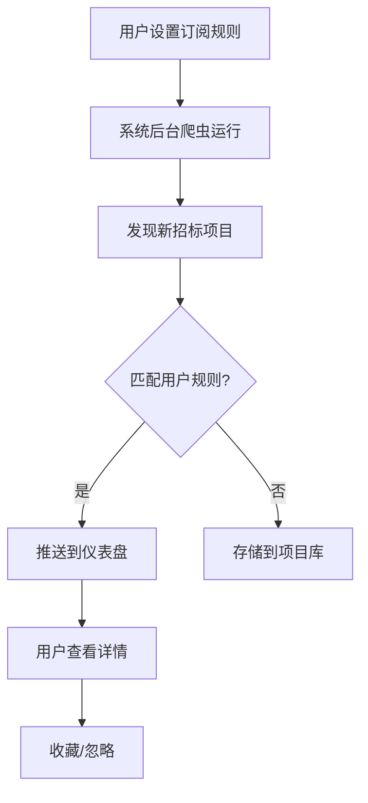

**界面元素：**
- 订阅规则设置面板（关键词、地域、金额范围）
- 项目推送卡片（标题、金额、地域、匹配度）
- 快速操作按钮（查看详情、收藏、忽略）

**优先级：** P2（阶段2实现）

---

#### **A2. 智能项目推荐与匹配**

**功能描述：**
- 基于企业画像计算项目匹配度
- AI自动评估项目与企业能力的契合度
- 优先推送高匹配度项目

**交互流程：**
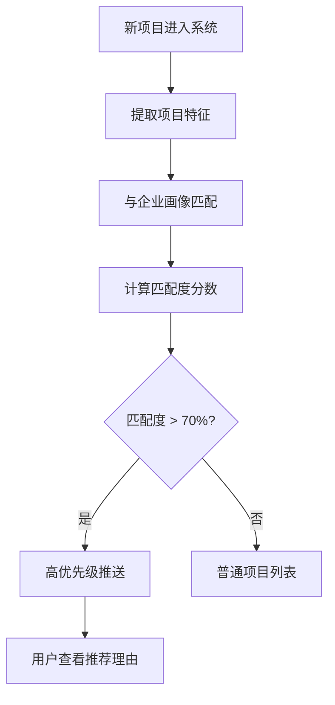

**界面元素：**
- 匹配度指示器（0-100分，颜色渐变）
- 匹配原因卡片（资质匹配、业绩匹配、区域匹配）
- "为什么推荐"按钮（展开详细分析）

**优先级：** P2（阶段2实现）

---

#### **A3. 项目快速评估报告**

**功能描述：**
- 【部分保留】通过问答提取项目关键信息
- 【新增】一键生成结构化评估报告PDF
- 【新增】自动比对企业资质

**交互流程：**
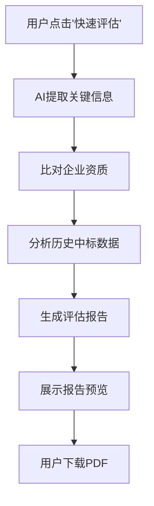

**报告内容：**
1. 项目概况摘要
2. 核心资质要求对比（✓符合 / ✗不符合）
3. 关键时间节点（报名、投标、开标）
4. 类似项目历史中标情况
5. 风险点提示

**界面元素：**
- "快速评估"按钮（项目详情页）
- 评估报告预览面板（可折叠各部分）
- 下载按钮（PDF / Word）

**优先级：** P2（阶段2实现）

---

### 2.3 模块B：智能标书工作台【保留核心 + 增强UI + 新增功能】

#### **B1. 招标文件智能深度解析**【保留85% + 增强15%】

**功能描述：**

**【保留】核心解析能力：**
- ✅ PDF全文OCR与文本化（MinerU + PyMuPDF + pdfplumber）
- ✅ 智能检测文档类型（文本型 vs 扫描件）
- ✅ 实时解析进度（页码级精度）
- ✅ 通过Agentic RAG回答任何问题

**【增强】UI交互优化：**
- 🆕 自动生成响应任务清单（Checklist）
- 🆕 废标/风险条款自动高亮标注
- 🆕 三栏布局（原文 | 解析结果 | 任务清单）

**交互流程：**
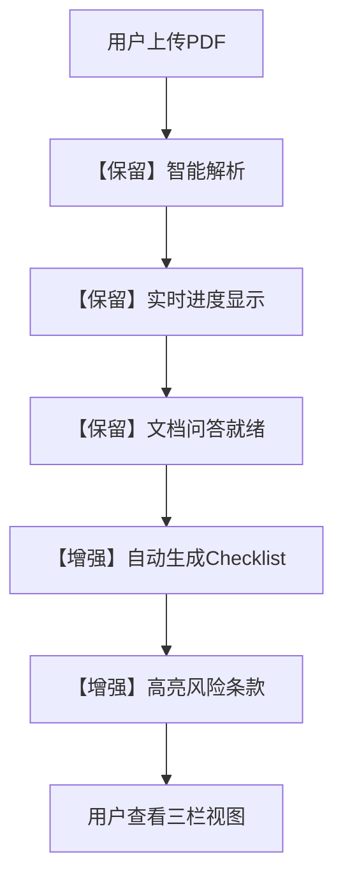

**界面设计（三栏布局）：**

**左栏：原始文档预览【增强】**
- PDF预览（支持缩放、滚动）
- 风险条款高亮显示（红色/黄色标记）
- 点击高亮跳转到对应原文

**中栏：结构化解析结果【保留 + 增强】**
- 【保留】智能问答输入框
- 【增强】可折叠的信息卡片：
  - 项目基本信息（预算、工期、地点）
  - 资质要求清单
  - 技术参数清单
  - 商务条款要点
  - 评分标准细则
  - 风险与废标项（自动标红）

**右栏：响应任务清单【增强】**
- 【增强】自动生成的Checklist：
  - ☐ 提供营业执照（截止日期：XX）
  - ☐ 提供XX资质证书
  - ☐ 填写技术参数响应表
  - ☐ 提交3个类似项目业绩
  - ...
- 任务状态标记（待办 / 进行中 / 已完成）
- 指派给团队成员（下拉选择）
- 添加备注和讨论

**优先级：** P0（阶段1实现增强功能）

---

#### **B2. 企业级知识库管理**【保留40% + 新增60%】

**功能描述：**

**【保留】基础能力：**
- ✅ 文档上传和存储
- ✅ 向量化和检索（FAISS + BM25）
- ✅ 多场景文档隔离

**【新增】可视化管理：**
- 🆕 知识库分类管理界面
- 🆕 文档标签和搜索
- 🆕 资质到期提醒
- 🆕 业绩库结构化展示

**交互流程：**
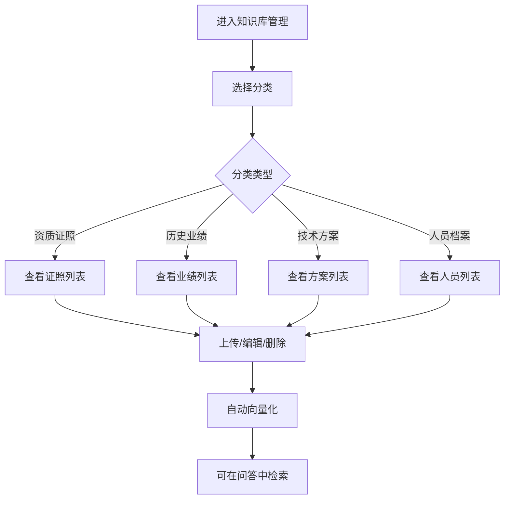

**界面设计：**

**知识库管理页面（新增）**
- 顶部：分类Tab（资质证照 | 历史业绩 | 技术方案 | 人员档案）
- 左侧：过滤和搜索面板
  - 搜索框（支持全文搜索）
  - 标签过滤（多选）
  - 日期范围过滤
- 右侧：文档列表（卡片或表格视图）
  - 卡片模式：缩略图 + 标题 + 标签 + 操作按钮
  - 表格模式：文件名 | 类别 | 标签 | 上传日期 | 操作

**资质证照特殊功能：**
- 到期日期字段
- 即将到期提醒（30天内变黄，已过期变红）
- 自动提醒通知（邮件/系统通知）

**历史业绩特殊功能：**
- 结构化字段：项目名称、金额、地点、时间、客户、验收结果
- 智能推荐：根据当前招标文件要求，自动推荐最匹配的业绩案例

**优先级：** P1（阶段1实现）

---

#### **B3. 标书内容智能生成与填充**【保留30% + 增强70%】

**功能描述：**

**【保留】基础能力：**
- ✅ 通过问答获取内容（"如何响应XX条款"）
- ✅ 基于知识库的内容检索

**【增强】自动化生成：**
- 🆕 "一键生成"按钮（生成章节初稿）
- 🆕 智能匹配知识库内容（自动填充资质、业绩）
- 🆕 内容推荐（AI建议相关业绩案例）

**交互流程：**
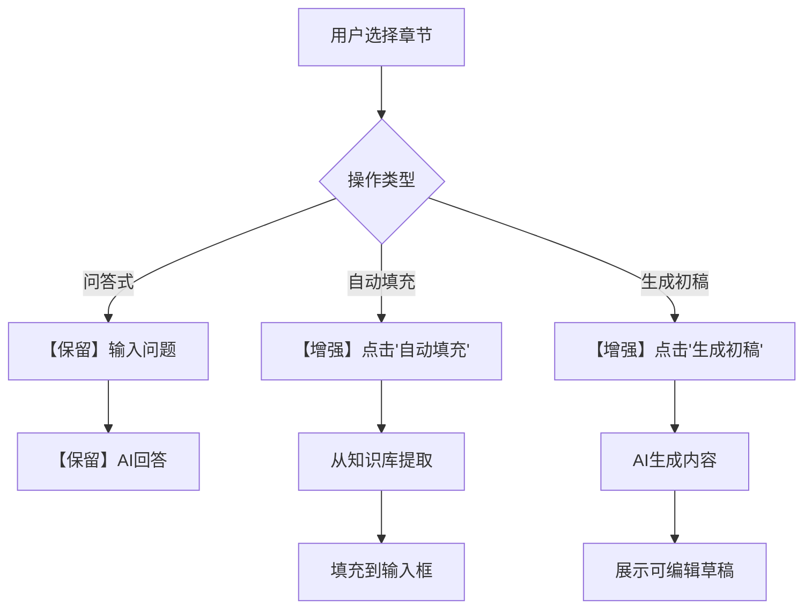

**界面元素：**

**聊天界面增强【增强】**
- 【保留】原有问答输入框和消息气泡
- 【增强】新增"生成内容"按钮组：
  - "生成公司简介"
  - "生成技术方案"
  - "生成服务承诺"
  - "生成质量保证措施"
- 【增强】智能推荐卡片：
  - "系统推荐3个相关业绩案例，点击查看"
  - 点击后展开业绩详情，可一键插入

**生成结果展示【增强】**
- 生成的内容在消息气泡中显示
- 提供"复制"、"编辑"、"重新生成"按钮
- 支持Markdown格式渲染

**优先级：** P1（阶段1实现）

---

#### **B4. 智能排版与格式审查**【新增】

**功能描述：**
- 模板一键应用（字体、字号、页边距）
- 自动生成目录和页码
- 格式合规性审查

**说明：** 此功能需要集成在线文档编辑器（如WPS、Google Docs），属于长期规划。

**优先级：** P3（阶段4实现）

---

#### **B5. 智能自检与多维度校对**【保留25% + 增强75%】

**功能描述：**

**【保留】问答式检查：**
- ✅ 用户可以询问"是否遗漏XX条款"
- ✅ 用户可以询问"技术参数是否一致"

**【增强】自动化检查：**
- 🆕 响应完整性自动检查（扫描整个标书，比对Checklist）
- 🆕 关键词一致性检查（技术参数、金额、日期）
- 🆕 错敏信息校对（错别字、标点、单位）
- 🆕 生成可视化检查报告

**交互流程：**
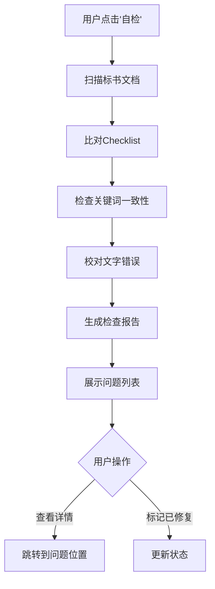

**检查报告界面【增强】**
- 总体评分（0-100分）
- 问题分类统计（严重 / 警告 / 建议）
- 问题列表：
  - 🔴 严重：未响应的必填项（3处）
  - 🟡 警告：技术参数不一致（2处）
  - 🔵 建议：可能的错别字（5处）
- 点击问题跳转到具体位置

**优先级：** P1（阶段1实现）

---

### 2.4 模块C：智能决策辅助【新增】

#### **C1. 中标概率预测**

**功能描述：**
- 基于机器学习模型预测中标概率
- 显示影响因素（项目类型、区域、企业实力）
- 提供情景模拟（"如果提高报价5%，概率如何变化"）

**优先级：** P3（阶段3实现）

---

#### **C2. 智能报价建议**

**功能描述：**
- 基于历史数据提供报价区间建议
- 竞争对手报价分析
- 利润率情景模拟

**优先级：** P3（阶段3实现）

---

#### **C3. 竞争对手画像分析**

**功能描述：**
- 追踪公开中标信息
- 构建竞争对手画像（优势领域、报价习惯）
- 竞争策略建议

**优先级：** P3（阶段3实现）

---

## 3. 关键交互流程

### 3.1 主仪表盘（Dashboard）交互流程【新增】

**入口：** 用户登录后的第一个界面

**布局设计：**

```
+-----------------------------------------------------------+
|  Logo  |  主导航（仪表盘|项目|知识库|聊天）  |  用户菜单  |
+-----------------------------------------------------------+
|                                                           |
|  +-------------------+  +---------------------------------+
|  |  我的待办         |  |  关键商机速递                   |
|  |  - 项目1截止3小时 |  |  [项目卡片1] 匹配度 85%         |
|  |  - 标书2需初审   |  |  [项目卡片2] 匹配度 78%         |
|  |  ...             |  |  [项目卡片3] 匹配度 72%         |
|  +-------------------+  +---------------------------------+
|                                                           |
|  +-------------------------------------------------------+
|  |  投标项目概览（甘特图/看板）                          |
|  |  [项目A - 评估中] [项目B - 标书编制中] [项目C - 已提交]|
|  +-------------------------------------------------------+
|                                                           |
|  +-------------------------------------------------------+
|  |  数据洞察（KPIs）                                     |
|  |  本月新增商机: 12  |  投标金额: 3500万  |  预测中标率: 65%  |
|  +-------------------------------------------------------+
|                                                           |
+-----------------------------------------------------------+
```

**交互特点：**
- "零点击信息获取"：重要信息一目了然
- 所有卡片都是可点击的快捷入口
- 全局搜索功能（快速查找项目、文档）

**优先级：** P2（阶段2实现）

---

### 3.2 文档上传与解析流程【保留 + 增强】

**【保留】当前流程：**

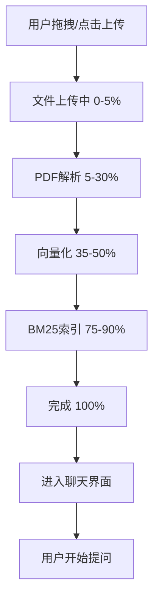

**【增强】优化流程：**

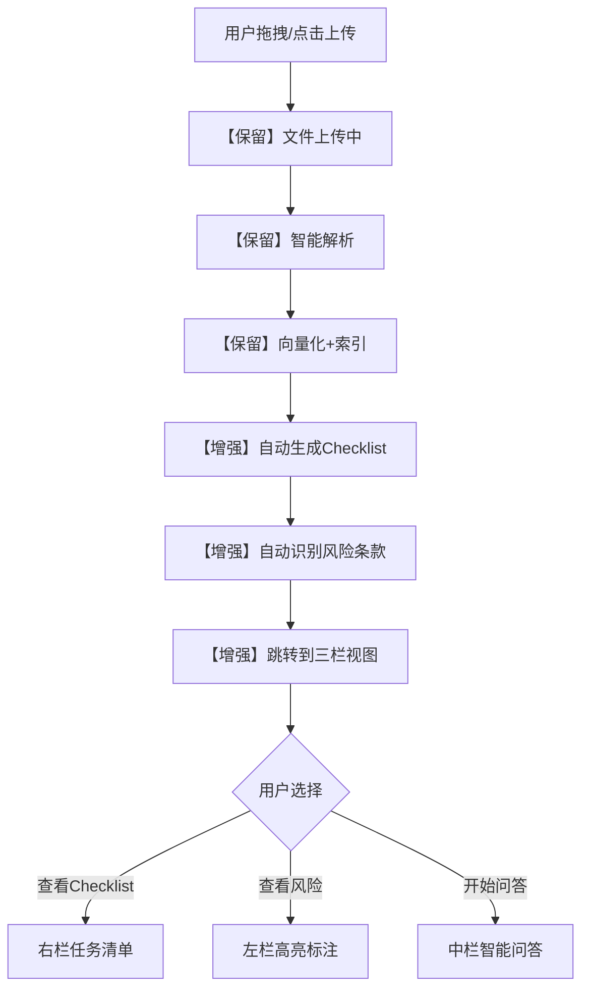

**关键优化点：**
1. 【保留】解析进度实时显示（页码级）
2. 【增强】解析完成后自动执行后续任务（Checklist、风险识别）
3. 【增强】提供多种视图入口（任务清单 / 风险查看 / 问答）

---

### 3.3 智能问答交互流程【保留】

**当前流程（完全保留）：**

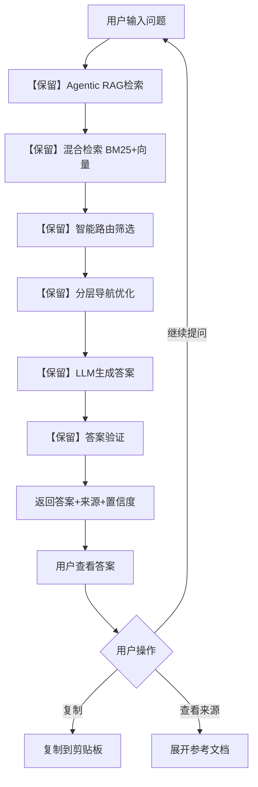

**核心特性（保持不变）：**
- ✅ 2-10秒响应时间
- ✅ 置信度评估（高/中/低）
- ✅ 参考来源引用（页码+相关度）
- ✅ 多轮对话上下文理解
- ✅ 缓存加速（命中率>30%）

**优先级：** 【保留】核心功能不修改

---

### 3.4 自动生成Checklist流程【增强】

**触发时机：** 文档解析完成后自动执行

**执行流程：**

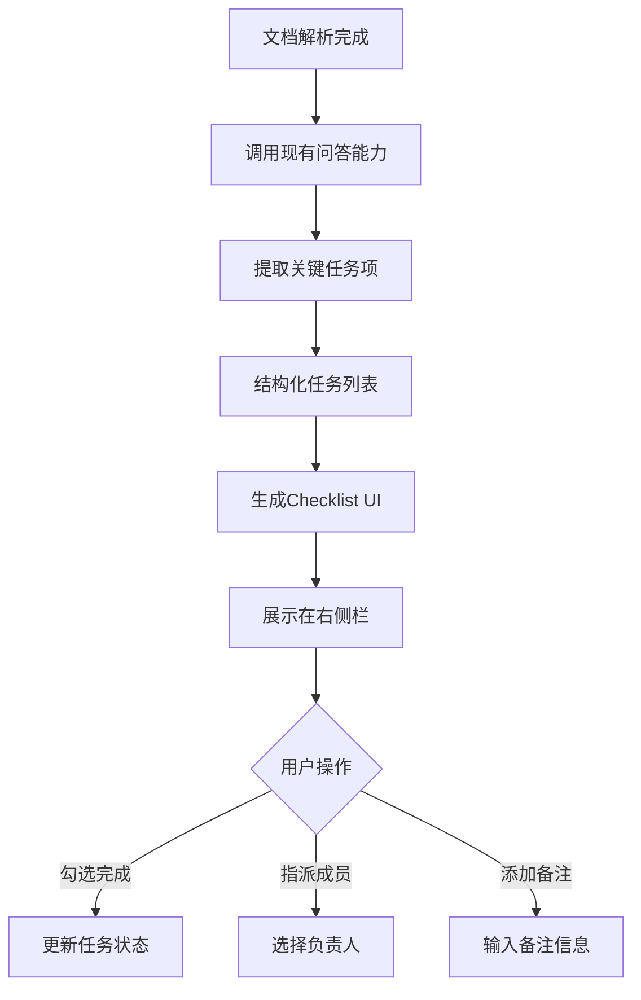

**技术实现（不修改核心RAG）：**
- 新建API端点：`POST /api/v2/documents/{id}/checklist`
- 调用现有的`QuestionsProcessor`提问：
  - "请列出本招标文件中需要提供的所有资质文件"
  - "请列出本招标文件中需要响应的技术参数"
  - "请列出本招标文件中的关键时间节点"
- 解析LLM返回的列表，生成结构化JSON
- 前端渲染为可交互的Checklist组件

**优先级：** P0（阶段1实现）

---

### 3.5 风险条款高亮流程【增强】

**触发时机：** 文档解析完成后自动执行

**执行流程：**

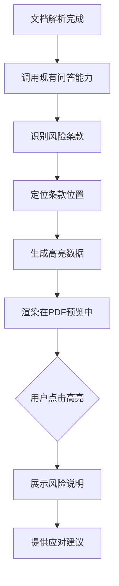

**风险类别标识：**
- 🔴 严重风险：废标条款、无限责任条款
- 🟡 中等风险：苛刻的支付条件、不合理工期
- 🟢 低风险：需特别注意的条款

**技术实现（不修改核心RAG）：**
- 新建服务：`backend/services/risk_service.py`
- 调用现有的`QuestionsProcessor`提问：
  - "请识别本招标文件中可能导致废标的条款"
  - "请识别本招标文件中对投标方不利的条款"
- 解析LLM返回的风险点，提取页码和位置
- 前端在PDF预览中叠加高亮层

**优先级：** P0（阶段1实现）

---

## 4. 界面原型描述

### 4.1 主仪表盘界面【新增】

**页面路由：** `/dashboard`

**主要区域：**

1. **顶部导航栏**
   - Logo + 产品名称
   - 主导航：仪表盘 | 项目列表 | 知识库 | 聊天问答
   - 右侧：通知图标 + 用户头像 + 场景选择器

2. **我的待办区域（左上）**
   - 卡片式布局
   - 待办事项列表（按紧急程度排序）
   - 每项显示：任务名称 + 截止时间 + 快速操作

3. **关键商机速递区域（右上）**
   - 3-5个项目卡片（横向排列）
   - 每个卡片：项目名称 + 预算 + 匹配度 + 操作按钮
   - "查看更多"链接

4. **投标项目概览区域（中间）**
   - 看板视图（Trello风格）或甘特图
   - 项目卡片可拖动（改变状态）
   - 状态列：评估中 | 标书编制中 | 已提交 | 等待开标 | 已中标/未中标

5. **数据洞察区域（底部）**
   - 3-4个KPI卡片
   - 可视化图表（折线图、饼图）
   - 支持下钻查看详情

**交互特点：**
- 所有卡片支持悬停效果（阴影、边框高亮）
- 点击卡片跳转到详情页
- 支持自定义布局（拖拽调整区域大小）

**优先级：** P2

---

### 4.2 招标文件解析界面（三栏布局）【增强】

**页面路由：** `/documents/{id}`

**布局描述：**

```
+------------------------------------------------------------+
| 顶部导航栏                                                   |
+------------------------------------------------------------+
| 面包屑: 知识库 > 招标文件 > 项目名称.pdf                      |
+------------------------------------------------------------+
|                                                            |
|  [左栏: 30%]  |  [中栏: 40%]  |  [右栏: 30%]              |
|  原文预览     |  解析结果     |  任务清单                 |
|               |               |                           |
|  PDF显示      |  智能问答     |  ☐ 任务1                 |
|  (支持缩放)   |  输入框       |  ☐ 任务2                 |
|               |               |  ☐ 任务3                 |
|  【风险高亮】 |  信息卡片:    |  ...                     |
|  🔴 废标条款  |  - 项目信息   |                           |
|  🟡 风险条款  |  - 资质要求   |  [添加任务]              |
|               |  - 技术参数   |                           |
|               |  - 商务条款   |  [团队成员]              |
|               |               |  - 李工                   |
|               |  [生成内容]   |  - 王工                   |
|               |  按钮组       |                           |
|                                                            |
+------------------------------------------------------------+
```

**左栏交互：**
- PDF缩放控制（+/-按钮，滚轮缩放）
- 风险高亮点击：展示风险说明弹窗
- 双击文本：复制选中内容

**中栏交互：**
- 【保留】智能问答输入框（保持现有体验）
- 【增强】信息卡片可折叠/展开
- 【增强】"生成内容"按钮组（点击生成对应章节）
- 卡片内容可点击复制

**右栏交互：**
- 任务勾选（完成/未完成）
- 任务展开：显示详情、备注、讨论
- 指派任务：下拉选择团队成员
- 添加新任务：点击展开输入框

**优先级：** P0（阶段1实现）

---

### 4.3 智能标书工作台【保留 + 增强】

**当前界面（保留）：**
- 聊天式界面（深色主题）
- 消息气泡（用户问题 + AI回答）
- 输入框（底部，支持拖拽上传）
- 场景选择器（顶部）

**增强点：**
1. **输入框区域增强**
   - 【新增】"生成内容"按钮组（在输入框上方）
   - 【保留】原有的上传附件按钮
   - 【保留】发送按钮

2. **消息气泡增强**
   - 【新增】"一键插入"按钮（将AI生成的内容插入到编辑器）
   - 【保留】复制、重新生成按钮

3. **侧边栏增强（可选）**
   - 【新增】知识库快速访问面板（可折叠）
   - 【新增】历史对话列表

**优先级：** P1（阶段1实现增强功能）

---

### 4.4 知识库管理界面【新增】

**页面路由：** `/knowledge`

**布局描述：**

```
+------------------------------------------------------------+
| 顶部导航栏                                                   |
+------------------------------------------------------------+
| [Tab切换] 资质证照 | 历史业绩 | 技术方案 | 人员档案 | 全部   |
+------------------------------------------------------------+
|                                                            |
|  [左侧: 25%]          |  [右侧: 75%]                       |
|  搜索与过滤           |  文档列表                           |
|                       |                                    |
|  [搜索框]             |  [视图切换] 卡片 | 列表             |
|  输入关键词...        |                                    |
|                       |  +------------------------------+ |
|  [标签过滤]           |  | [卡片1]                       | |
|  □ 电力设备           |  | 缩略图 | 营业执照             | |
|  □ 资质认证           |  |        | 标签: 资质、证照    | |
|  □ 项目业绩           |  |        | 到期: 2026-12-31   | |
|                       |  |        | [查看][编辑][删除] | |
|  [日期过滤]           |  +------------------------------+ |
|  开始: [日期选择]     |  | [卡片2]                       | |
|  结束: [日期选择]     |  | ...                           | |
|                       |  +------------------------------+ |
|  [重置过滤]           |                                    |
|                       |  [分页控制] < 1 2 3 ... >         |
+------------------------------------------------------------+
| 底部: [批量操作] [上传新文档]                                |
+------------------------------------------------------------+
```

**交互特点：**
- 搜索实时过滤（输入时即刻响应）
- 标签多选（选中后高亮，再次点击取消）
- 卡片悬停效果（阴影加深、边框高亮）
- 拖拽上传（整个页面都是Drop Zone）

**特殊功能：**
- **资质证照**：到期提醒（即将到期变黄，已过期变红）
- **历史业绩**：智能推荐标记（根据当前项目需求）
- **技术方案**：版本管理（显示最新版本号）
- **人员档案**：在线/离线状态

**优先级：** P1（阶段1实现）

---

### 4.5 项目列表界面【新增】

**页面路由：** `/projects`

**布局：** 表格视图 + 过滤器

**表格列：**
| 项目名称 | 预算 | 地域 | 截止日期 | 匹配度 | 状态 | 操作 |
|---------|------|------|---------|--------|------|------|
| XX变电站工程 | 3000万 | 广东 | 2天后 | 85% | 待评估 | [评估][收藏] |
| YY配电项目 | 1500万 | 江苏 | 5天后 | 72% | 已收藏 | [查看][忽略] |
| ... | ... | ... | ... | ... | ... | ... |

**交互特点：**
- 表头可排序（点击切换升序/降序）
- 匹配度带颜色（>80%绿色，60-80%黄色，<60%灰色）
- 状态带状态徽章（颜色区分）
- 行悬停高亮

**优先级：** P2（阶段2实现）

---

## 5. 功能优先级矩阵

### 5.1 按阶段划分

| 阶段 | 时间 | 功能类型 | 核心功能 | 交付成果 |
|------|------|----------|----------|----------|
| **阶段1** | 2个月 | 【增强】核心交互优化 | - Checklist自动生成<br>- 风险条款高亮<br>- 知识库可视化<br>- 一键生成内容 | MVP版本 |
| **阶段2** | 5个月 | 【新增】信息流打通 | - 招标信息爬虫<br>- 项目推荐引擎<br>- 企业画像<br>- 项目评估报告 | Beta版本 |
| **阶段3** | 9个月 | 【新增】决策智能化 | - 中标概率预测<br>- 报价策略建议<br>- 竞争对手画像<br>- 数据看板 | V1.0版本 |
| **阶段4** | 12个月+ | 【新增】协作与集成 | - 在线编辑器<br>- 多人协作<br>- ERP/CRM集成<br>- 移动端App | 企业版 |

---

### 5.2 按优先级划分

#### **P0（立即实现，0-2个月）**

| 功能 | 类型 | 用户价值 | 技术难度 |
|------|------|----------|----------|
| Checklist自动生成 | 【增强】 | ⭐⭐⭐⭐⭐ | ⭐⭐ |
| 风险条款高亮 | 【增强】 | ⭐⭐⭐⭐⭐ | ⭐⭐ |
| 知识库可视化管理 | 【新增】 | ⭐⭐⭐⭐ | ⭐⭐⭐ |

---

#### **P1（3-5个月）**

| 功能 | 类型 | 用户价值 | 技术难度 |
|------|------|----------|----------|
| 一键生成内容 | 【增强】 | ⭐⭐⭐⭐ | ⭐⭐ |
| 响应完整性检查 | 【增强】 | ⭐⭐⭐⭐ | ⭐⭐⭐ |
| 三栏布局界面 | 【增强】 | ⭐⭐⭐⭐ | ⭐⭐ |

---

#### **P2（6-9个月）**

| 功能 | 类型 | 用户价值 | 技术难度 |
|------|------|----------|----------|
| 招标信息爬虫 | 【新增】 | ⭐⭐⭐⭐⭐ | ⭐⭐⭐⭐ |
| 项目推荐引擎 | 【新增】 | ⭐⭐⭐⭐ | ⭐⭐⭐ |
| 企业画像系统 | 【新增】 | ⭐⭐⭐⭐ | ⭐⭐⭐ |
| 项目评估报告 | 【新增】 | ⭐⭐⭐⭐ | ⭐⭐⭐ |
| 主仪表盘 | 【新增】 | ⭐⭐⭐⭐ | ⭐⭐ |

---

#### **P3（9个月+）**

| 功能 | 类型 | 用户价值 | 技术难度 |
|------|------|----------|----------|
| 中标概率预测 | 【新增】 | ⭐⭐⭐⭐⭐ | ⭐⭐⭐⭐⭐ |
| 报价策略建议 | 【新增】 | ⭐⭐⭐⭐ | ⭐⭐⭐⭐ |
| 竞争对手画像 | 【新增】 | ⭐⭐⭐ | ⭐⭐⭐ |
| 在线编辑器集成 | 【新增】 | ⭐⭐⭐⭐⭐ | ⭐⭐⭐⭐⭐ |

---

### 5.3 商业价值 vs 实现难度矩阵

```
          高商业价值
              ▲
              │
  P0 立即做   │   P2 分阶段做
  ─────────────┼─────────────
  - Checklist │   - 爬虫
  - 风险高亮  │   - 推荐引擎
  - 知识库    │   - 中标预测
              │
  ────────────┼─────────────► 高实现难度
              │
  P1 优先做   │   P3 长期规划
  ─────────────┼─────────────
  - 内容生成  │   - 在线编辑器
  - 完整性检查│   - 多人协作
  - 三栏布局  │   - 移动端App
              │
          低商业价值
```

---

## 6. 用户体验原则

### 6.1 核心原则

1. **【保留】自动化优先**
   - 尽可能减少重复性手动操作
   - AI能做的，不让用户手动做

2. **【保留】结果可解释与可干预**
   - AI的任何建议都提供"为什么"
   - 用户始终拥有最终决策权

3. **【新增】主动推送，智能提醒**
   - 不等用户来问，主动推送关键信息
   - 重要截止日期提前提醒

4. **【新增】无缝协同**
   - 支持团队成员任务分配和协作
   - 打破部门墙

5. **【保留】数据安全与保密**
   - 所有数据加密传输和存储
   - 权限管理和访问控制

---

### 6.2 交互设计规范

#### **按钮规范**
- 主要操作：蓝色填充按钮（`bg-blue-500`）
- 次要操作：灰色描边按钮（`border-gray-300`）
- 危险操作：红色填充按钮（`bg-red-500`）
- 所有按钮：`rounded-xl`（大圆角）

#### **颜色规范**
- 背景：黑灰色系（`gray-900`, `gray-800`, `gray-700`）
- 文字：白色/浅灰（`gray-100`, `gray-200`）
- 强调：蓝色（`blue-500`）、紫色（`purple-500`）
- 成功：绿色（`green-500`）
- 警告：黄色（`yellow-500`）
- 错误：红色（`red-500`）

#### **动画规范**
- 卡片悬停：上浮2px + 阴影增强（`hover:translate-y-[-2px]`）
- 按钮悬停：颜色加深 + 轻微放大（`hover:scale-105`）
- 页面切换：淡入动画（`fade-in`）
- 列表加载：骨架屏动画

#### **响应式规范**
- 桌面端（>1280px）：三栏布局
- 平板端（768-1280px）：两栏布局
- 移动端（<768px）：单栏布局 + 底部导航

---

## 7. 测试与验收标准

### 7.1 功能测试标准

#### **阶段1功能（P0/P1）**

| 功能 | 验收标准 |
|------|----------|
| **Checklist自动生成** | - 上传招标文件后，30秒内生成Checklist<br>- Checklist包含至少10个任务项<br>- 任务项准确率 > 90% |
| **风险条款高亮** | - 自动识别至少3类风险（废标、无限责任、苛刻条款）<br>- 风险识别准确率 > 85%<br>- 高亮位置准确（可点击跳转） |
| **知识库可视化** | - 支持4类分类（资质、业绩、方案、人员）<br>- 搜索响应时间 < 1秒<br>- 支持多标签过滤 |
| **一键生成内容** | - 生成响应时间 < 10秒<br>- 生成内容逻辑通顺、符合要求<br>- 支持重新生成 |

---

### 7.2 性能测试标准

| 指标 | 当前系统 | 目标系统 |
|------|---------|---------|
| **文档解析速度** | 5-10秒/100页 | 5-10秒/100页（保持） |
| **问答响应时间** | 2-10秒 | 2-10秒（保持） |
| **Checklist生成** | N/A | < 30秒 |
| **风险识别** | N/A | < 30秒 |
| **知识库搜索** | N/A | < 1秒 |
| **并发用户** | 100 | 100（保持） |

---

### 7.3 用户体验测试标准

- **易用性测试**：新用户5分钟内能完成首次文档上传和问答
- **满意度测试**：目标用户满意度 > 85%
- **任务完成率**：核心任务（上传→解析→问答→生成Checklist）完成率 > 95%
- **错误率**：用户操作错误率 < 5%

---

## 8. 附录

### 8.1 术语表

| 术语 | 定义 |
|------|------|
| **Agentic RAG** | 基于智能Agent的检索增强生成，包含路由、导航、验证等组件 |
| **Checklist** | 响应任务清单，列出标书制作过程中需要完成的所有任务 |
| **企业画像** | 企业的能力描述，包括资质、业绩、技术能力、目标市场等 |
| **匹配度** | 项目与企业能力的契合程度，0-100分 |
| **风险条款** | 招标文件中可能导致废标或对投标方不利的条款 |
| **三栏布局** | 左栏（原文）+ 中栏（解析）+ 右栏（任务）的界面布局 |

---

### 8.2 参考文档

- [招投标PRD与当前系统功能对比分析](./招投标PRD与当前系统功能对比分析.md)
- [中国电力行业招投标全流程AI提效工具PRD](./中国电力行业招投标全流程AI提效工具产品需求文档_(PRD).md)
- [项目功能总结](./项目功能总结.md)
- [系统架构设计文档](./招投标AI系统架构设计.md)
- [开发任务清单](./招投标AI系统开发任务清单.md)

---

**文档版本：** v1.0
**创建时间：** 2025年10月15日
**下次更新：** 阶段1开发完成后（预计2个月后）
**维护者：** 产品与设计团队

